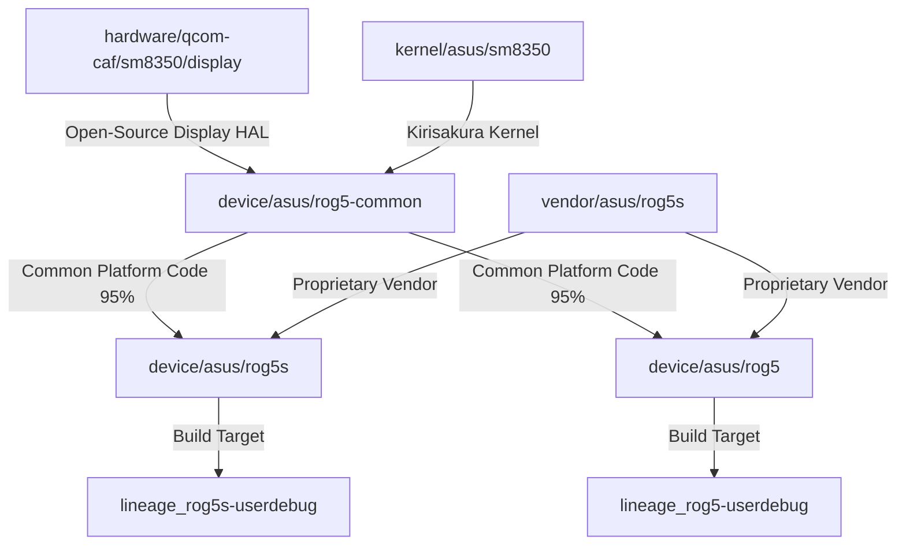

# 🚀 LineageOS 20.0 Developer & Build Onboarding Guide
**Target Devices:** ASUS ROG Phone 5 (`rog5` / `ZS673KS`) & ROG Phone 5s (`rog5s` / `ZS676KS`)  
**Platform:** Qualcomm Snapdragon 888 / 888+ (`sm8350` / `lahaina` / `lahainap`)  
**Android Version:** Android 13 (LineageOS 20.0)

---

## 📑 Overview & Architecture

This build tree follows the official LineageOS commonized device architecture:



---

## 🛠️ Repository Ecosystem Matrix

| Component | Directory Path | GitHub Repository URL | Branch |
| :--- | :--- | :--- | :---: |
| **Common Device Tree** | [`device/asus/rog5-common`](file:///mnt/android-build/device/asus/rog5-common) | [android_device_asus_rog5-common](https://github.com/sibinsilva/android_device_asus_rog5-common) | `lineage-20.0` |
| **ROG 5s Device Tree** | [`device/asus/rog5s`](file:///mnt/android-build/device/asus/rog5s) | [android_device_asus_rog5s](https://github.com/sibinsilva/android_device_asus_rog5s) | `lineage-20.0` |
| **ROG 5 Device Tree** | [`device/asus/rog5`](file:///mnt/android-build/device/asus/rog5) | [android_device_asus_rog5](https://github.com/sibinsilva/android_device_asus_rog5) | `lineage-20.0` |
| **Proprietary Vendor** | [`vendor/asus/rog5s`](file:///mnt/android-build/vendor/asus/rog5s) | [android_vendor_asus_rog5s](https://github.com/sibinsilva/android_vendor_asus_rog5s) | `lineage-20.0` |
| **Kernel Source** | [`kernel/asus/sm8350`](file:///mnt/android-build/kernel/asus/sm8350) | [android_kernel_asus_sm8350](https://github.com/sibinsilva/android_kernel_asus_sm8350) | `lineage-20.0` |
| **Display Hardware HAL** | [`hardware/qcom-caf/sm8350/display`](file:///mnt/android-build/hardware/qcom-caf/sm8350/display) | [LineageOS/android_hardware_qcom_display](https://github.com/LineageOS/android_hardware_qcom_display) | `lineage-20.0-caf-sm8350` |

---

## ⚡ Single-Run Helper Scripts (Artifact Repository)

The build helper scripts are stored inside the persistent artifact repository (outside `device/` and `vendor/` trees to prevent git dirty status):

### 1. Build Vendor Image for ROG Phone 5s
```bash
/home/sibindev9746_gmail_com/.gemini/antigravity-cli/brain/2fa1de3c-b3f6-4d41-8782-b318d84ad998/scratch/build_vendorimage_rog5s.sh
```

### 2. Build Vendor Image for ROG Phone 5
```bash
/home/sibindev9746_gmail_com/.gemini/antigravity-cli/brain/2fa1de3c-b3f6-4d41-8782-b318d84ad998/scratch/build_vendorimage_rog5.sh
```

### 3. Build Full LineageOS 20.0 ROM Zip for ROG Phone 5s
```bash
/home/sibindev9746_gmail_com/.gemini/antigravity-cli/brain/2fa1de3c-b3f6-4d41-8782-b318d84ad998/scratch/build_full_rom_rog5s.sh
```

### 4. Audit & Sync All Core Repositories
```bash
/home/sibindev9746_gmail_com/.gemini/antigravity-cli/brain/2fa1de3c-b3f6-4d41-8782-b318d84ad998/scratch/sync_all_repos.sh
```

---

## 💻 Step-by-Step Manual Compilation Guide

### Step 1: Initialize Environment & Ccache
```bash
cd /mnt/android-build

export USE_CCACHE=1
export CCACHE_EXEC=/usr/bin/ccache
export CCACHE_DIR="${HOME}/.ccache"
export CCACHE_MAXSIZE=50G

source build/envsetup.sh
```

### Step 2: Choose Build Lunch Target
- **For ROG Phone 5s (`ZS676KS`):**
  ```bash
  lunch lineage_rog5s-userdebug
  ```
- **For ROG Phone 5 (`ZS673KS`):**
  ```bash
  lunch lineage_rog5-userdebug
  ```

### Step 3: Run Build Command
- **To build `vendorimage` only (Fast iteration):**
  ```bash
  m vendorimage -j$(nproc)
  ```
- **To build full LineageOS ROM Zip (`bacon`):**
  ```bash
  m bacon -j$(nproc)
  ```

---

## ⚡ Flashing Instructions (fastbootd)

> [!IMPORTANT]
> Because ROG Phone 5 / 5s uses Dynamic A/B partitions, flashing dynamic logical partitions (`vendor`, `system`, `product`) MUST be done in **`fastbootd`** (userspace fastboot), NOT in raw bootloader fastboot.

```bash
# 1. Reboot from bootloader into userspace fastbootd
fastboot reboot fastboot

# 2. Flash the open-source vendor image
fastboot flash vendor out/target/product/rog5s/vendor.img

# 3. Reboot the device
fastboot reboot
```

---

## 🛡️ Key Architectural Rules for Developers

1. **Zero Display Blobbing:** Display HAL services (`composer-service`, `allocator-service`, `gralloc.default.so`) compile 100% from source code in `hardware/qcom-caf/sm8350/display`. Never inject prebuilt OEM display blobs into `vendor/asus/rog5s`.
2. **Strict Commonization:** Common overlay rules, init scripts, and HAL definitions belong in `device/asus/rog5-common/`. Specific device trees (`rog5s` and `rog5`) contain ONLY `prebuilts/` (DTB/DTBO) and specific product makefiles.
3. **Module Loading:** Kernel modules (`msm_drm.ko`) are declared directly via Makefile syntax (`BOARD_VENDOR_KERNEL_MODULES_LOAD := msm_drm.ko`). Avoid `$(shell cat ...)` during Kati evaluation.
