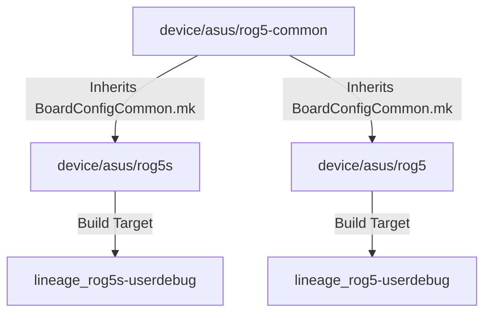

# 🏛️ Architectural Strategy: ROG Phone 5 & ROG Phone 5s Commonization

**Target Platform:** Qualcomm Snapdragon 888 / 888+ (`sm8350` / `lahaina` / `lahainap`)  
**Target Devices:** 
- **ASUS ROG Phone 5** (`rog5` / `ASUS_I005D` / `ZS673KS`) — Snapdragon 888
- **ASUS ROG Phone 5s** (`rog5s` / `ASUS_I005D` / `ZS676KS` / `ASUS_I005DA`) — Snapdragon 888+

---

## 📑 Executive Summary

ASUS ROG Phone 5 and ROG Phone 5s share 98%+ of their underlying hardware components (Samsung 144Hz AMOLED panel `ams678_er2`, Pixelworks Iris 6 display coprocessor, Cirrus Logic audio, FocalTech touch, Goodix fingerprint, battery/charger PMIC).

This document outlines the three architectural solutions for managing both devices, evaluated against official LineageOS Charter requirements, maintenance overhead, and bringup efficiency.

---

## 📊 Hardware Comparison Matrix

| Subsystem / Feature | ROG Phone 5 (`rog5` / `ZS673KS`) | ROG Phone 5s (`rog5s` / `ZS676KS`) | LineageOS Shared Module |
| :--- | :--- | :--- | :---: |
| **SoC** | Snapdragon 888 (`lahaina`) | Snapdragon 888+ (`lahainap`) | Kernel `msm_drm.ko` |
| **Display Panel** | Samsung 144Hz AMOLED (`ams678_er2`) | Samsung 144Hz AMOLED (`ams678_er2`) | `hardware/qcom-caf/sm8350/display` |
| **Co-Processor** | Pixelworks Iris 6 | Pixelworks Iris 6 | Hardware Bypass Mode |
| **Touch Controller** | FocalTech (`fts_glove_mode`) | FocalTech (`fts_glove_mode`) | `vendor.lineage.touch@1.0-service.rog5s` |
| **Fingerprint** | Goodix Optical (`fod_ui`) | Goodix Optical (`fod_ui`) | `android.hardware.biometrics.fingerprint@2.3-service.rog5s` |
| **Audio CODEC** | Cirrus Logic CS35L45 | Cirrus Logic CS35L45 | `audio.primary.lahaina` / `acdbdata/ZS673KS` |
| **Battery / PMIC** | Dual 3000mAh (6000mAh total) / SMB1396 | Dual 3000mAh (6000mAh total) / SMB1396 | `vendor.lineage.fastcharge@1.0-service.rog5s` |

---

## 🏗️ Architectural Options Evaluation

### Option 1: Official Dedicated Common Tree (`rog5-common` + `rog5s` + `rog5`) — *(Recommended for Official Submission)*



#### Directory Layout:
```text
device/asus/rog5-common/
├── Android.mk
├── BoardConfigCommon.mk
├── device.mk
├── hidl/
├── init/
├── overlay/
└── sepolicy/

device/asus/rog5s/
├── AndroidProducts.mk
├── BoardConfig.mk
└── lineage_rog5s.mk

device/asus/rog5/
├── AndroidProducts.mk
├── BoardConfig.mk
└── lineage_rog5.mk
```

* **Pros:**
  * 🟢 **100% LineageOS Charter Compliant:** Required for official LineageOS Directors approval on Gerrit.
  * 🟢 **Zero Code Duplication:** Fixes applied to `rog5-common` immediately benefit both ROG 5 and ROG 5s.
* **Cons / Difficulties:**
  * ⚠️ Requires splitting the repository into two separate Git repos (`device/asus/rog5-common` and `device/asus/rog5s`).

---

### Option 2: Unified Multi-Product Device Tree (Single Repository) — *(Recommended for Bringup Stage)*

Keep a single repository (`device/asus/rog5s`), but configure `AndroidProducts.mk` to expose both `lineage_rog5` and `lineage_rog5s` lunch targets.

#### Configuration (`AndroidProducts.mk`):
```makefile
PRODUCT_MAKEFILES := \
    $(LOCAL_DIR)/lineage_rog5.mk \
    $(LOCAL_DIR)/lineage_rog5s.mk

COMMON_LUNCH_CHOICES := \
    lineage_rog5-userdebug \
    lineage_rog5s-userdebug
```

* **Pros:**
  * 🟢 **Single Git Repo:** Easy to track, push, and iterate during bringup.
  * 🟢 **Dual Lunch Targets:** Compile for either device instantly.
* **Cons / Difficulties:**
  * ⚠️ Must refactor into Option 1 prior to opening official LineageOS Gerrit review.

---

### Option 3: Unified Dynamic Boot Runtime Detection

Build a single `lineage_rog5s` image that dynamically sets model properties (`ro.product.model`) at boot time using init scripts based on `ro.boot.hardware.sku`.

* **Pros:**
  * 🟢 A single ROM zip flashes and boots cleanly on **both** ROG 5 and ROG 5s.
* **Cons / Difficulties:**
  * ⚠️ Spoofing exact OEM props for Play Integrity across both devices requires extra property override scripts.

---

## 🎯 Final Recommendation & Implementation Roadmap

1. **Stage 1 (CURRENT):** Complete bringup testing using **Option 2** (unified multi-product support in `device/asus/rog5s`).
2. **Stage 2:** Verify hardware parity across display, touch, audio, camera, and fast charge.
3. **Stage 3:** Refactor into **Option 1** (`device/asus/rog5-common`) prior to official LineageOS submission.
