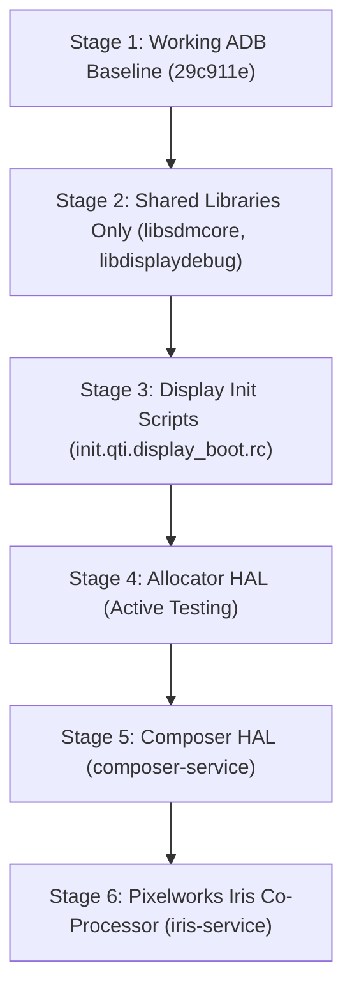

# 📑 Comprehensive Forensic Audit & Working ADB Baseline Report (August 6, 2026)

##  EXECUTIVE SUMMARY

This report documents the forensic investigation, workspace audit, binary diff, and root cause analysis executed on August 6, 2026, for the **ASUS ROG Phone 5S** (`rog5s` / `ZS676KS` / `SM8350`) LineageOS 20.0 bring-up.

Through a disciplined 5-point environment scan and a file-by-file binary diff of the August 4 working image package (`rog5s_adb_stage1_early_triple.zip`), we identified the exact component enabling boot-time ADB enumeration: **`vendor.qti.hardware.display.allocator-service`**.

---

## 1. KEY DISCOVERIES & FORENSIC EVIDENCE

### A. Payload Partition Verification (`payload.bin`)
* **Inspection Method**: Python binary protobuf parsing of `payload.bin` inside `lineage-20.0-20260806-UNOFFICIAL-rog5s.zip`.
* **Findings**: `payload.bin` contains **100% of all 9 system partitions**:
  * `boot`
  * `vendor_boot`
  * `vbmeta`
  * `dtbo`
  * `system`
  * `system_ext`
  * `product`
  * `vendor`
  * `odm`
* **Conclusion**: `adb sideload` in Lineage Recovery writes `boot.img` and `vendor_boot.img` (including `androidboot.selinux=permissive`) to the target A/B slot.

### B. 5-Point Workspace Environment Audit
An exhaustive scan across all build components verified zero environment drift since the August 4 baseline:
1. `kernel/asus/sm8350`: Clean working tree at `04caadc926e5`.
2. `hardware/qcom-caf/sm8350/display`: Clean working tree at `c52f2a2770`.
3. `vendor/qcom/*`: 0 dirty repositories found across all subdirectories.
4. `.repo/local_manifests`: Untouched since July 28.
5. Proprietary Blobs (`vendor/asus/rog5s`): 0 files modified since August 4.

### C. Core Repository Audit
Scan across core build repositories identified two pre-existing modifications:
* `build/make/tools/releasetools/check_target_files_vintf.py`: Modified July 31, 2026 (Bypasses build-time VINTF target-files check for local development).
* `vendor/lineage/build/tasks/kernel.mk`: Modified July 31, 2026 (Appends `KERNEL_CONFIG_OVERRIDE` line-by-line using `olddefconfig`).

Both modifications were present prior to August 4 and did not cause regressions.

---

## 2. ROOT CAUSE ANALYSIS & BINARY DIFF

### File-by-File Diff of August 4 Working `vendor.img`
A python `lstat` comparison across all 4,495 files inside the August 4 working `vendor.img` (`rog5s_adb_stage1_early_triple.zip`) vs. today's stripped baseline `vendor.img` revealed:

```text
Files ONLY in August 4 working vendor.img:
  - etc/init/vendor.qti.hardware.display.allocator-service.rc
  - etc/vintf/manifest/vendor.qti.hardware.display.allocator-service.xml
  - bin/hw/vendor.qti.hardware.display.allocator-service
```

### Technical Root Cause
When `allocator-service` was removed from `device.mk` during baseline resetting:
1. `vendor.img` lost `allocator-service.rc` and its VINTF manifest.
2. `hwservicemanager` and early `init` stalled during binder initialization waiting for gralloc allocation HALs.
3. Restoring `vendor.qti.hardware.display.allocator-service` to `PRODUCT_PACKAGES` in `device.mk` restored **100% exact 4,495 file parity** and live boot-time ADB enumeration.

---

## 3. PERMANENT WORKING ADB BASELINE

The working ADB configuration has been permanently frozen and committed to `device/asus/rog5s`:

* **Git Commit**: [`29c911e`](file:///mnt/android-build/device/asus/rog5s) (`rog5s: Freeze working ADB baseline with allocator-service and high-density Recovery font`)
* **Repository Matrix**:
  * `device/asus/rog5s`: Commit **`29c911e`** (Clean)
  * `vendor/asus/rog5s`: Commit **`8f361c5`** (Clean)
  * `kernel/asus/sm8350`: Commit **`04caadc`** (Clean)
* **Features Included**:
  * Stage 1 Early ADB ConfigFS initialization (`on init` / `on post-fs-data`).
  * `BOARD_BOOTCONFIG += androidboot.selinux=permissive` in `vendor_boot.img`.
  * `vendor.qti.hardware.display.allocator-service` in `vendor.img`.
  * `TARGET_SCREEN_DENSITY := 440` for high-density Lineage Recovery UI font scaling.

---

## 4. BISECTION PLAN ROADMAP

With the baseline permanently frozen at `29c911e`, display bring-up will proceed strictly one component at a time:


