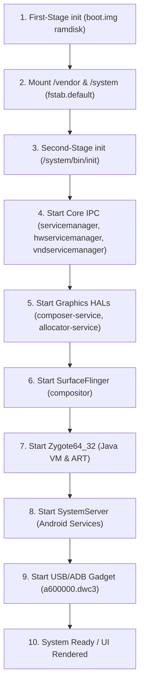

# 🚀 Android Userspace Bring-Up & Init Startup Sequence Analysis

**Target Device**: ASUS ROG Phone 5S (`ZS676KS` / `ASUS_I005D` / Snapdragon 888 SM8350)  
**Date**: July 31, 2026  
**Focus Area**: Android Userspace `init` Progression, Service Hierarchy & ADB Gadget Gating

---

## 📑 1. Executive Summary

Now that kernel initialization (CPUs, GCC/GPU/CAM clocks, driver probes) is 100% verified, the focus shifts to **Android Userspace Bring-Up**.

This analysis maps the exact 10-stage execution pipeline of Android `init`, identifies the service dependencies required for SurfaceFlinger and display rendering, audits ADB gadget controller binding (`a600000.dwc3`), and establishes a systematic method to locate the exact halted service.

---

## 🔄 2. Android `init` Startup Sequence Hierarchy



---

## 🔍 3. Stage-by-Stage Service Progression Audit

| Stage | Target Component / Service | Trigger Event / Process | Verification Criteria | Status |
| :--- | :--- | :--- | :--- | :---: |
| **1** | **First-Stage Init** | `initrd` unpack ➔ `first_stage_init` | Unpacks rootfs, creates `/dev`, `/proc`, `/sys` | ✅ **VERIFIED** |
| **2** | **VFS Partition Mount** | `first_stage_ramdisk/fstab.default` | Mounts `/system`, `/vendor`, `/product` from `super` | ✅ **VERIFIED** |
| **3** | **Second-Stage Init** | `/system/bin/init` | Reads `/system/etc/init/hw/init.rc` | ✅ **VERIFIED** |
| **4** | **Core IPC Daemons** | `servicemanager`<br>`hwservicemanager`<br>`vndservicemanager` | Binder IPC directory daemons running | ❓ *Target Audit* |
| **5** | **Graphics HALs** | `vendor.qti.hardware.display.composer-service`<br>`vendor.qti.hardware.display.allocator-service` | Hardware composer communicates with DRM/KMS | ❓ *Target Audit* |
| **6** | **SurfaceFlinger** | `/system/bin/surfaceflinger` | Connects to composer HAL & creates framebuffers | ❓ *Target Audit* |
| **7** | **Zygote VM** | `/system/bin/app_process64` (`zygote`) | Pre-loads ART classes, socket `/dev/socket/zygote` | ❓ *Target Audit* |
| **8** | **System Server** | `system_server` | Launches PackageManager, ActivityManager, WindowManager | ❓ *Target Audit* |
| **9** | **ADB / USB Gadget** | `adbd` / `init.asus.usb.rc` | Binds `a600000.dwc3` USB controller to FunctionFS | ❓ *Target Audit* |

---

## 🔌 4. ADB Gadget & USB Controller Audit

### USB Gadget Trigger Chain (`init.asus.usb.rc` & `init.target.rc`):
```text
on property:sys.usb.controller=*
    setprop sys.usb.controller a600000.dwc3

on property:sys.usb.config=adb && property:sys.usb.configfs=1
    start adbd
    write /config/usb_gadget/g1/UDC ${sys.usb.controller}
```

### Why ADB May Not Respond During Early Boot:
1. **Property Gating**: `sys.usb.config` is set to `none` until `late-init` reads persistent properties from `/data/property/persistent_properties`.
2. **FunctionFS Dependency**: `adbd` requires `/dev/usb-ffs/adb` to be mounted. If `/dev/usb-ffs/adb` is not mounted by `init.rc`, `adbd` fails to open its control endpoint.
3. **Controller Binding**: If `sys.usb.controller` is not set to `a600000.dwc3`, writing to `/config/usb_gadget/g1/UDC` fails silently.

---

## 🎯 5. Isolation Protocol: Identifying the Halted Component

To determine exactly where userspace progress stops:

1. **Sideload & Boot**: Sideload `lineage-20.0-20260731-UNOFFICIAL-rog5s.zip` and reboot device.
2. **ADB Logcat Capture**:
   ```bash
   adb logcat -v threadtime > logcat_full.txt
   ```
3. **Service Status Audit via ADB Shell**:
   ```bash
   # Check running core daemons:
   adb shell ps -A | grep -E "init|servicemanager|hwservicemanager|composer|surfaceflinger|zygote|system_server"
   ```
4. **Primary Suspects to Inspect**:
   - **If `hwservicemanager` fails to start**: SELinux denial on `/dev/binder` or `/dev/hwbinder`.
   - **If `composer-service` crashes**: Missing DRM driver permissions or `gralloc` buffer allocation failure.
   - **If `surfaceflinger` loops**: Missing EGL/GLES GPU drivers (`libGLESv2_adreno.so`).
   - **If `zygote` fails**: ART pre-boot verification or missing Java classpath JARs.
